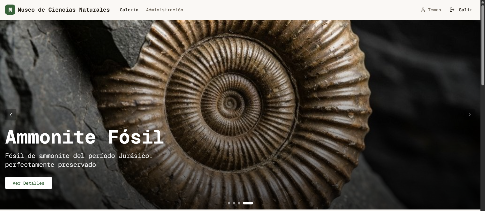
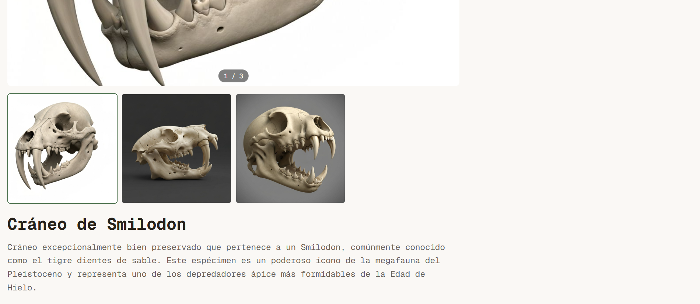
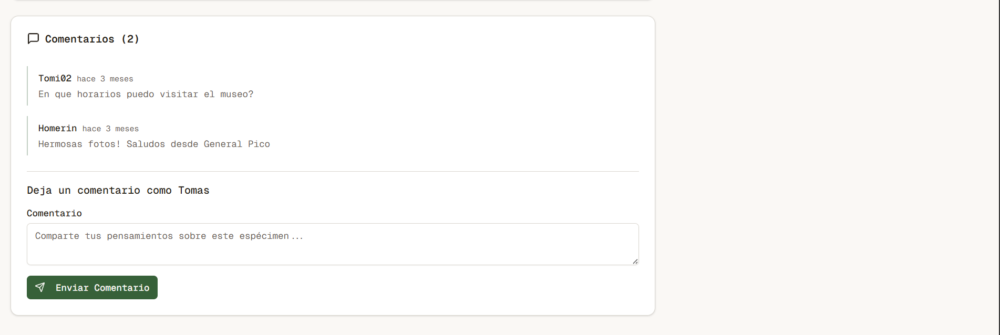
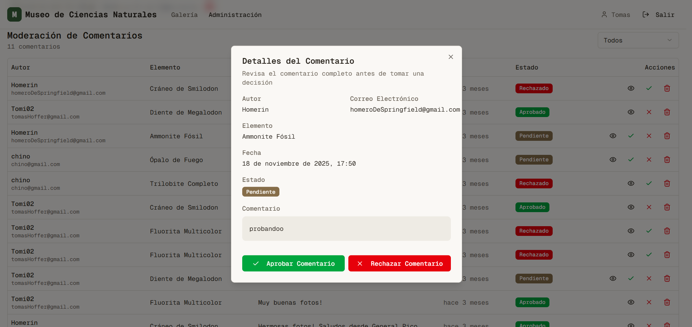
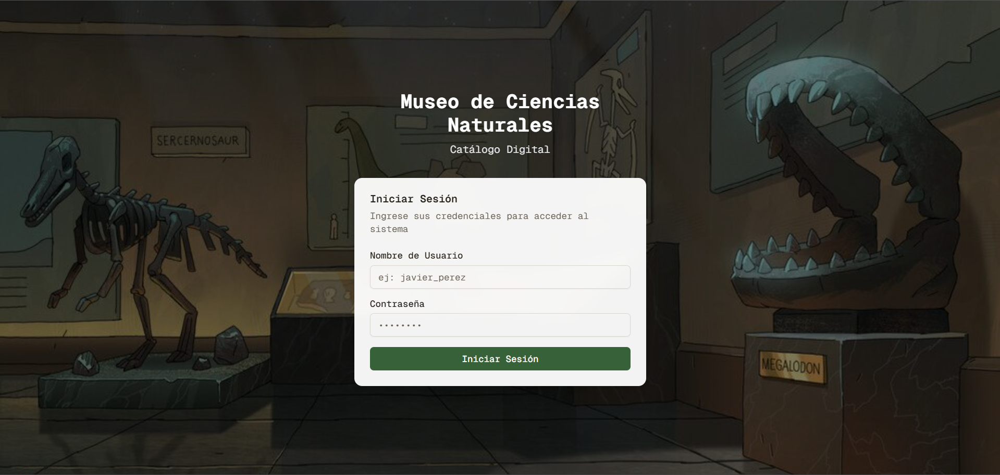
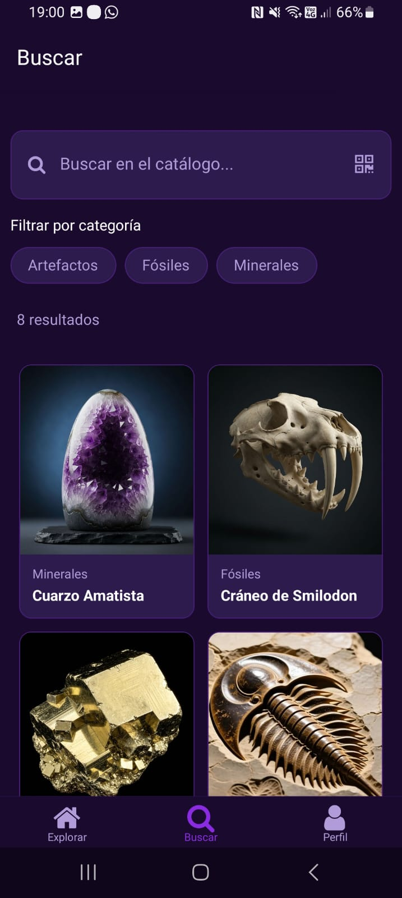
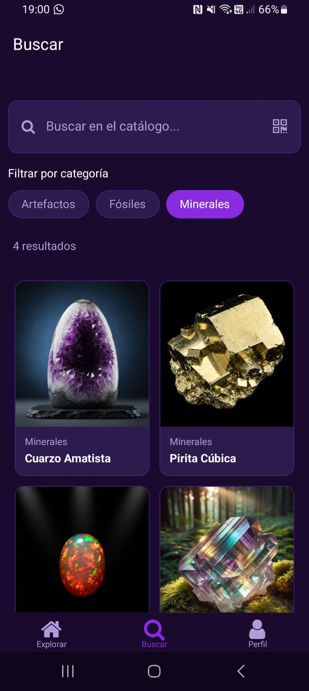
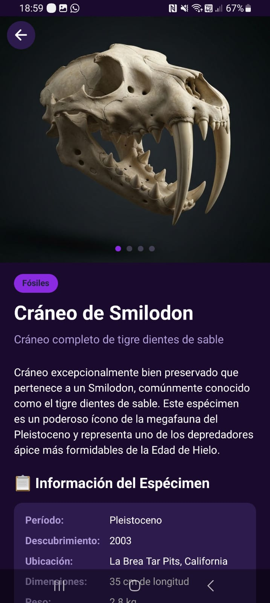
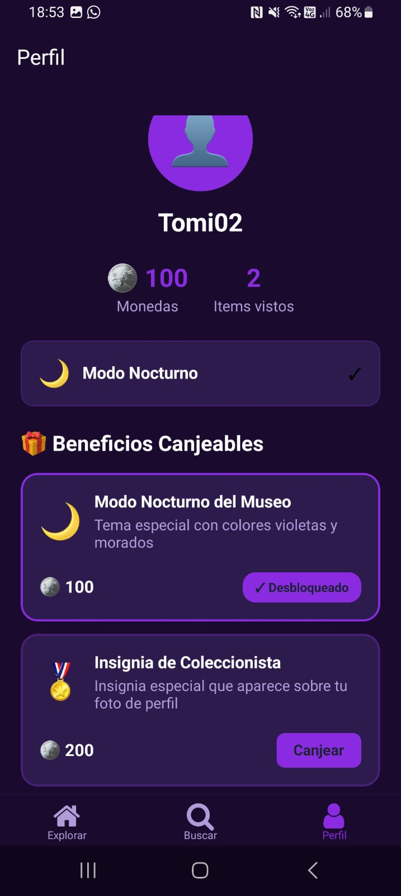

  

 
<h1 align="center">Hi!, I'm Tomás Hoffer </h1>
<picture></picture> About me
<picture> </picture>
  

- :school: I am a junior at [Facultad de Ingeniería](https://www.ing.unlpam.edu.ar/) at [Universidad Nacional de La Pampa](https://www.unlpam.edu.ar/)
- :technologist: I’m currently learning ...
    - JavaScript
    - React
    - React Native
    - Java
    - Spring Boot
    - PHP
- :nerd_face: Always `learning new things`.
- ✔ Ask me about anything, I am happy to help
- :thinking: I’m currently open for a new `job opportunity`
 
My Skills Include

<h4> Languages and Frameworks </h4>
 
  
  
  
  
  
  
  
  
  
  
  

<h4> Databases </h4>

  
  
  

<h4> IDE </h4>

<h4> Other Tools and Technologies </h4>

  
  
  

 

  

<h3 align="center">Mis Proyectos Destacados</h3>

<table align="center">
  <tr>
    <td align="center" width="50%">
      <strong>Web (React + Next.js)</strong>
    </td>
    <td align="center" width="50%">
      <strong>App Móvil (React Native + Expo)</strong>
    </td>
  </tr>
  <tr>
    <td align="center" valign="top">
      
        
      
      

        
<strong>📸 Ver galería completa (8 más)</strong>

         
         
          
         
          
         
          
         
      

      
       
      <a href="https://github.com/TomasHoffer2002/proyectoMuseo">🔗 Ver Repositorio</a>
    </td>

    <td align="center" valign="top">
      
        
      
      

        
<strong>📱 Ver más pantallas (7 más)</strong>

         
         
          
         
          
         
          
        
      

      
       
      <a href="https://github.com/TomasHoffer2002/proyectoMuseoAPP">🔗 Ver Repositorio</a>
    </td>
  </tr>
</table>
