

  

 
<h1 align="center">Hi!, I'm Tomás Hoffer </h1>

<picture></picture> About me

<picture></picture>

  

- 🎓 Analista Programador — [Facultad de Ingeniería](https://www.ing.unlpam.edu.ar/), [Universidad Nacional de La Pampa](https://www.unlpam.edu.ar/) *(carrera finalizada, título en trámite)*
- 💻 Desarrollador Full Stack especializado en **React / React Native** y **PHP**
- 🚀 Experiencia real en producción: app de gestión industrial desplegada y en uso en fábrica
- 🌱 Siempre aprendiendo cosas nuevas
- 💬 Preguntame lo que quieras, con gusto ayudo
- 📫 Contacto: tomas.hoffer@ing.unlpam.edu.ar
- 🔍 Abierto a nuevas oportunidades laborales

 

## 🛠 My Skills

<h4>Languages & Frameworks</h4>

  
  
  
  
  
  
  
  
  
  
  
  
  

<h4>Databases</h4>

  
  
  

<h4>DevOps & Deploy</h4>

  
  
  
  

<h4>IDEs & Design Tools</h4>

  
  
  
  
  

  

---

<h2 align="center">💼 Proyectos Destacados</h2>

---

<h3 align="center">🏭 App de Gestión de Mantenimiento Industrial — Aisplac S.A.</h3>

  Aplicación multiplataforma desarrollada de forma individual durante mi práctica profesional en <strong>Aisplac S.A.</strong>, empresa fabricante de paneles PVC en General Pico, La Pampa. Permite gestionar órdenes de trabajo de mantenimiento de equipos industriales: emisión de OT únicas y programadas, aceptación/rechazo, historial por equipo y gestión de tareas. <strong>La app está actualmente en producción y siendo usada en planta por ingenieros y operarios.</strong> El despliegue completo (frontend en Vercel + backend PHP/MySQL en servidor LAMP en DonWeb) y la capacitación al personal fueron realizados por mí como servicio profesional independiente.

  
  
  
  
  
  

  
    

  

    
<strong>📱 Ver más pantallas (15 más)</strong>

     
    
    
    
      
    
    
    
      
    
    
    
      
    
    
    
      
    
    
    
  

 
 

<h3 align="center">🌿 App de Arbolado Urbano — Municipalidad de General Pico</h3>

  Aplicación multiplataforma desarrollada en equipo para la <strong>Dirección de Arbolado y Parques Urbanos</strong> de la Secretaría de Ambiente de la Municipalidad de General Pico, en el marco de las Prácticas Comunitarias de la UNLPam. El sistema permite gestionar el arbolado urbano de la ciudad. Repositorio privado por acuerdo con la institución.

  
  
  
  

<em>Repositorio privado — proyecto entregado a la Municipalidad.</em>

 
 

<h3 align="center">🦕 Ecosistema Digital — Museo de Ciencias Naturales</h3>

  Desarrollé junto a un colega este ecosistema digital para un Museo de Ciencias Naturales, integrando una web (React + Next.js) y una app móvil (React Native + Expo) que consumen una misma API REST en PHP con base de datos MySQL. Este proyecto consolidó mis habilidades en arquitectura Full Stack, enseñándome a diseñar soluciones multiplataforma con datos centralizados y a trabajar colaborativamente.

  
  
  
  
  
  

<h4 align="center">Web: React + Next.js</h4>

  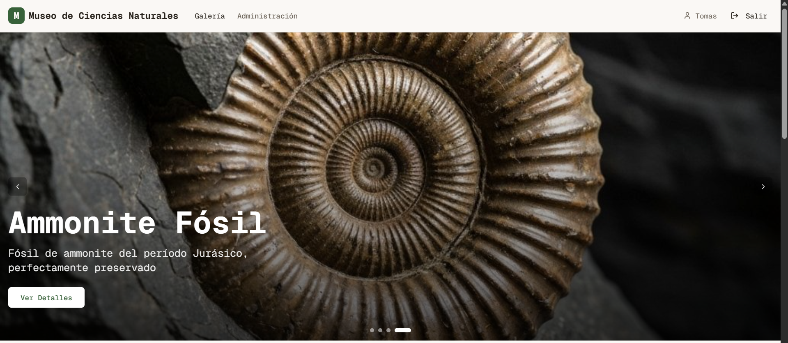
    

  

    
<strong>📸 Ver galería completa Web (8 más)</strong>

     
    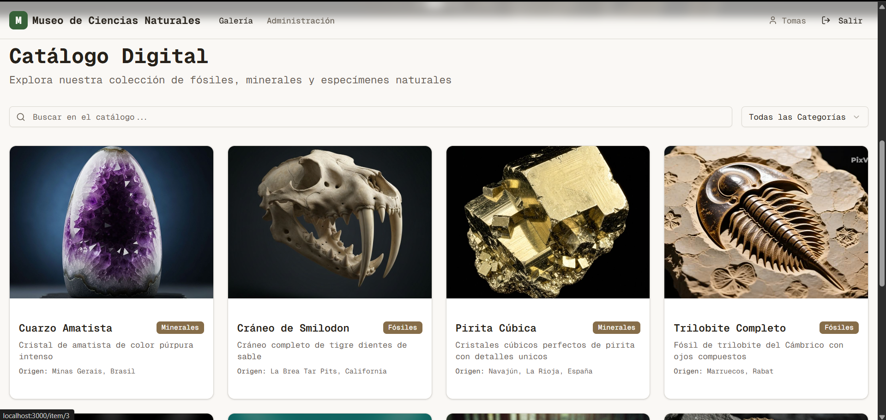  
    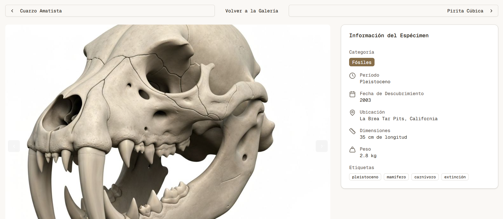  
    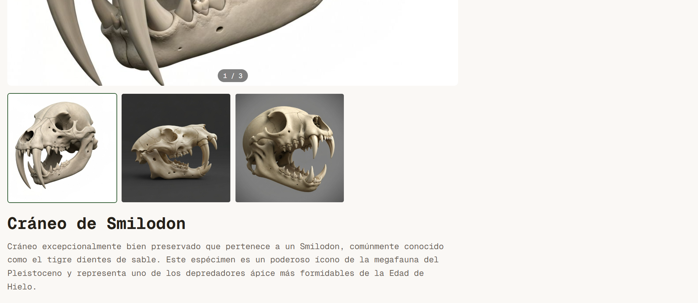  
    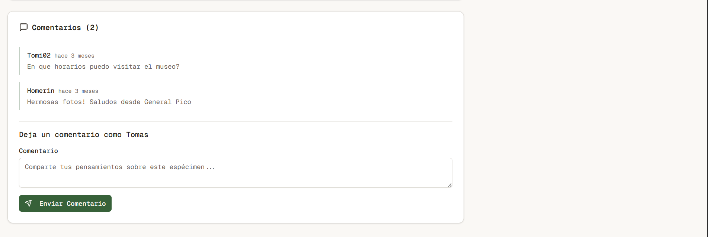  
    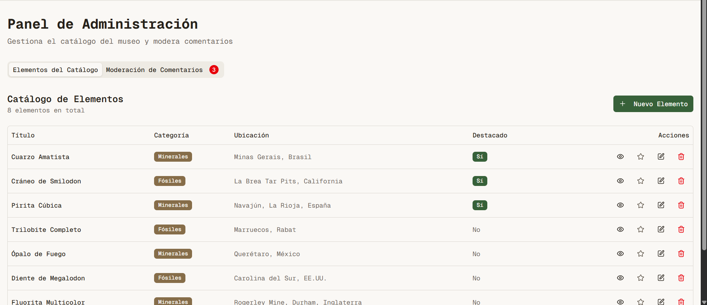  
    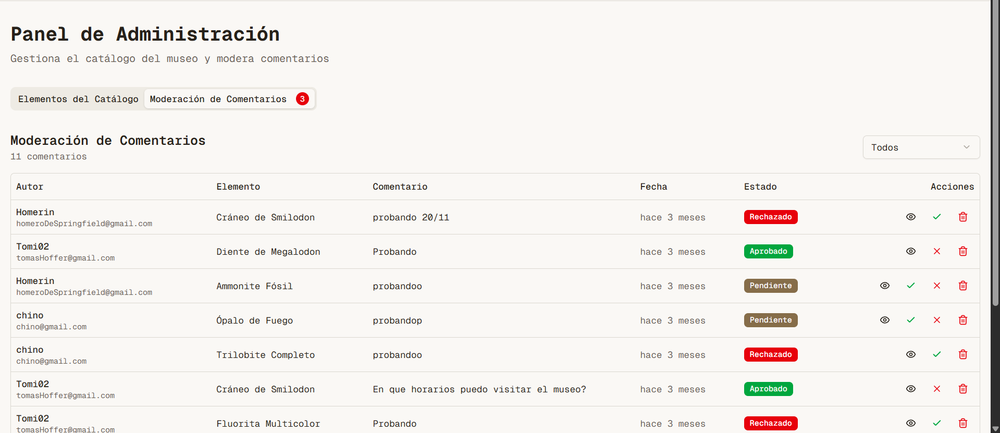  
    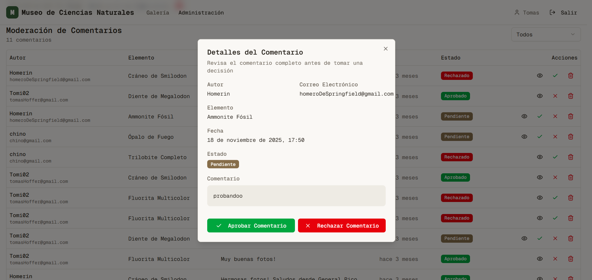  
    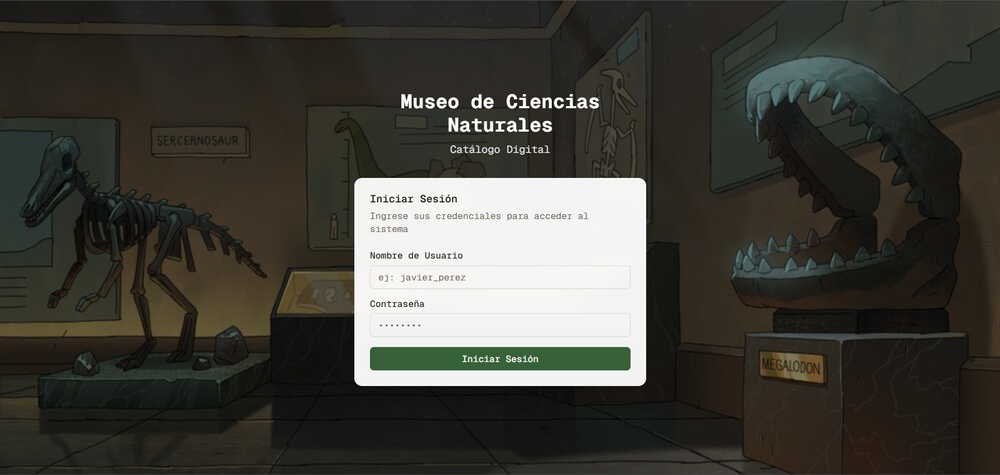
  

   
  <a href="https://github.com/TomasHoffer2002/proyectoMuseo">🔗 Ver Repositorio Web</a>

 

<h4 align="center">App Móvil: React Native + Expo</h4>

  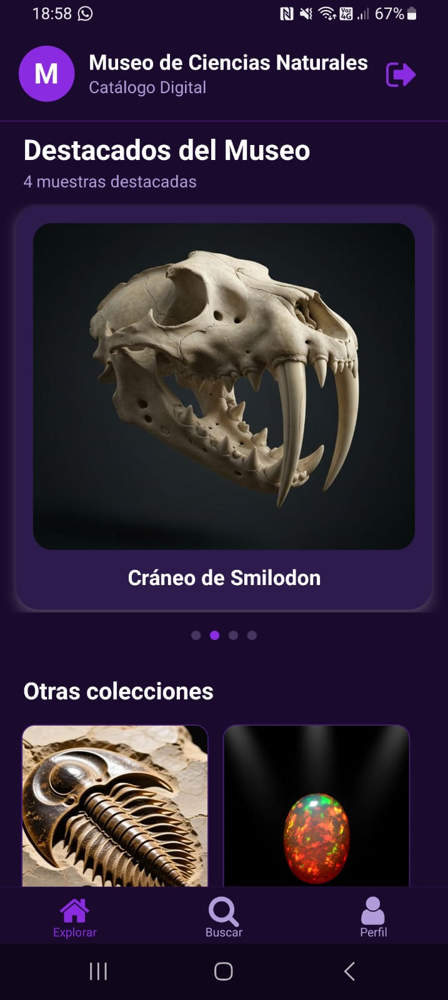
    

  

    
<strong>📱 Ver más pantallas App (7 más)</strong>

     
    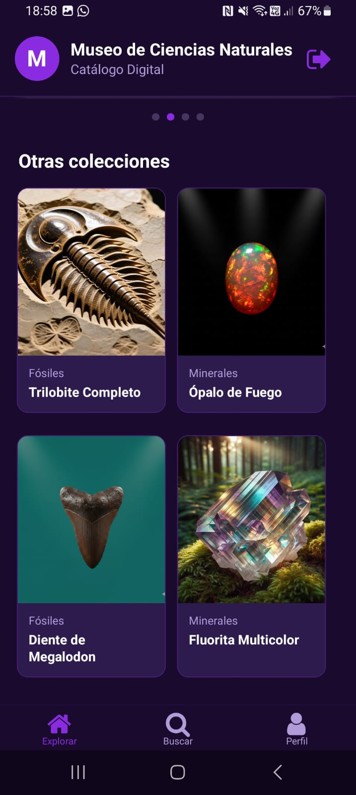 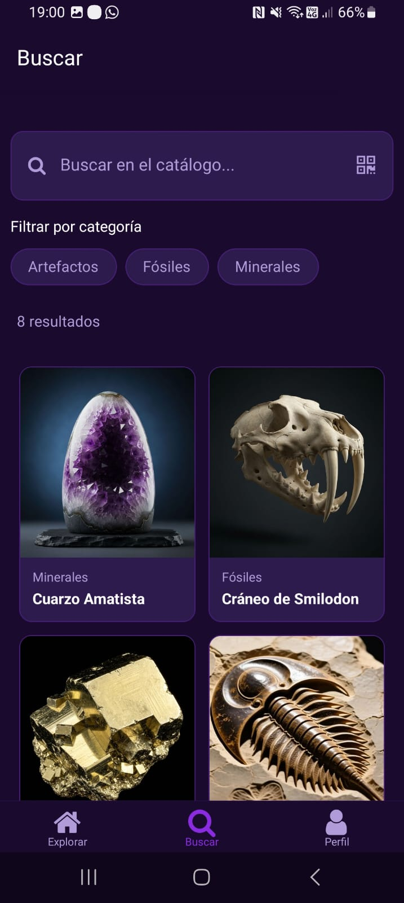 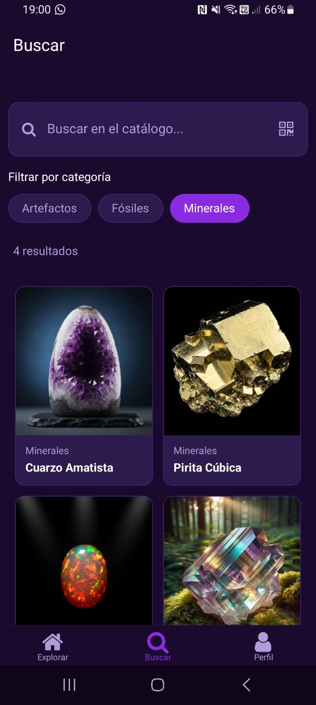
      
    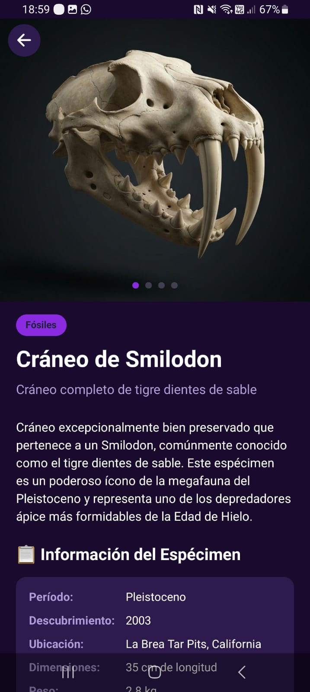 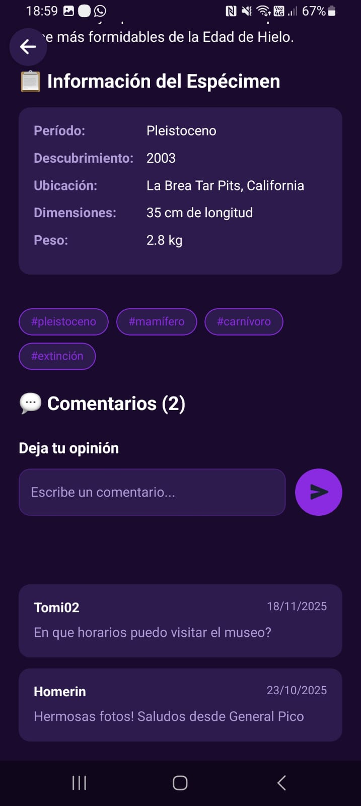 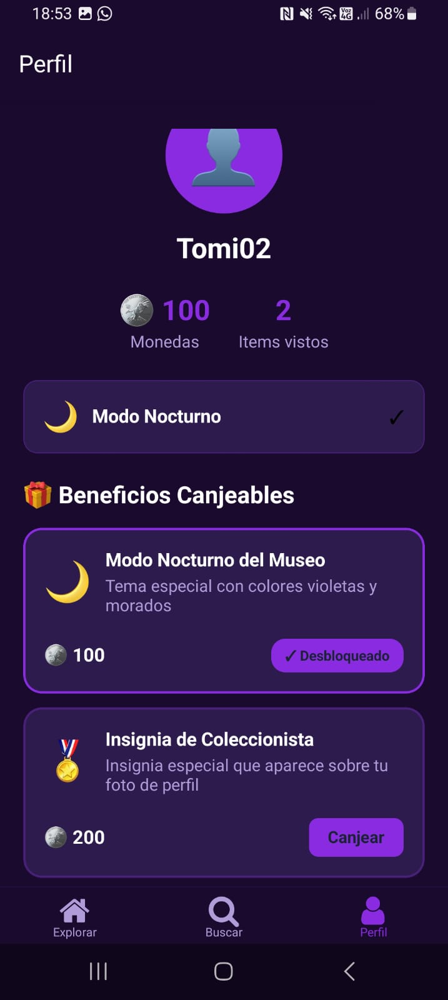
      
    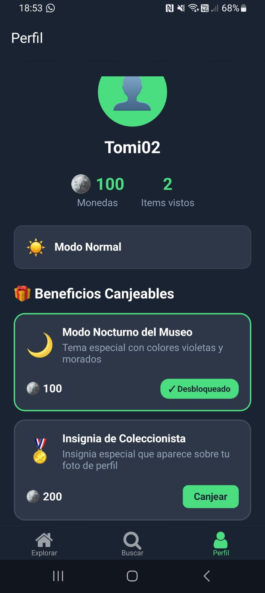
  

   
  <a href="https://github.com/TomasHoffer2002/proyectoMuseoAPP">🔗 Ver Repositorio App</a>

 
 

<h3 align="center">⚙️ API REST — Java / Spring Boot</h3>

  API REST desarrollada con Java y Spring Boot aplicando arquitectura MVC en capas y patrones de diseño (DAO, Facade, Singleton, Reflection), bajo metodología RUP. Proyecto académico para sistema de gestión de empresa de reciclaje.

  
  
  

  <a href="https://github.com/TomasHoffer2002/Grupo_4_PrimeraIteracion">🔗 Ver Repositorio</a>

 
 

<h3 align="center">🎨 Diseño UI — Billetera Virtual</h3>

  Diseño completo de interfaces de usuario para una billetera virtual, realizado en Figma como proyecto final de la materia Diseño de Interfaces de Usuario (nota: 9).

  

  <a href="https://www.figma.com/design/5FUIIdxAQF9EdpDoKzMfEP/Proyecto-Final---Grupo-06?node-id=0-1&t=pGxTF6ysIMT34Kfa-1">🔗 Ver Proyecto en Figma</a>

